# ServiceDesk-Simulator
I am utilizing ServiceDesk-Simulator in order to gain real world experience in solving tickets for end users.

## Scenario 1: Moved to a new team and cannot access their files or folders

1. Scenario Overview

   
  <em>Figure 1. Initial ticket.</em>

2. Initial Assessment

* Kavita Patel's manager submitted a ticket as she was transferring departments and needed access to a new set of tools specific to that department. The manager also requested that she be removed from the old group as well. Transferring groups can be done in Active Directory.

3. Investigation/Resolution

* The first step that I took check the Active Directory and search up Kavtia Patel.

   
  <em>Figure 2. Active Directory Search.</em>

* Once I clicked on her name, I went to the "Groups" tab and found that she was under "Engineering".

   
  <em>Figure 3. Engineering Group.</em>

* I then removed her from the "Engineering" group to the "IT Infrastructure" group.

   
  <em>Figure 4. IT Infrastructure Group.</em>

* Lastly, I messaged her manager Tom Wilson, who submitted the ticket to confirm whether or not the changes were submitted correctly.

   
  <em>Figure 5. User Confirmation.</em>

   
  <em>Figure 6. Manager Confirmation.</em>

4. Lessons Learned

* Department transfers require removing old groups and adding new ones.
* Not removing access to old group memberships provides a security risk as they have accesss that is no longer necessary.
* Always need to verify if the transfer request comes from an authorized user.
* Make sure to document every change like who requested it and when.

5. Technologies Used

* Active Directory (Simulated)

## Scenario 2: New employee starting Monday - needs account setup

1. Scenario Overview

  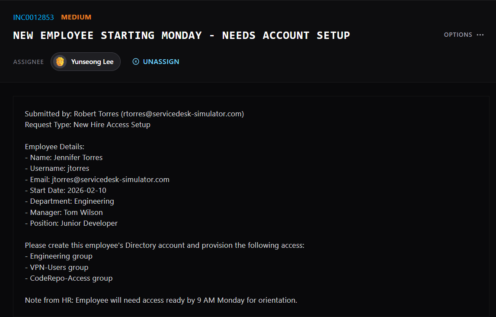 
  <em>Figure 1. Initial ticket.</em>

2. Initial Assessment

* Robert Torres submitted a ticket for a new hire with the name of Jennifer Torres. He provided all of the employee's relevant details and outlined which sepcific groups that she needs to be included in to gain specific access.

3. Investigation/Resolution

* The first step that I took was to go to Active Directory to create a profile for Jennifer.

  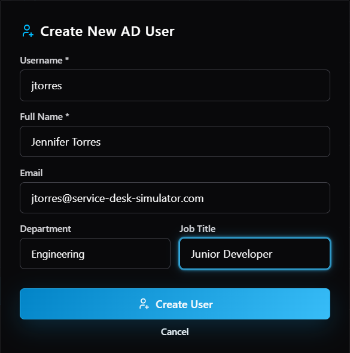 
  <em>Figure 2. Create User.</em>

* After filling out the initial information, I went to the "Groups" tab and added her to the additional groups that were requested.

  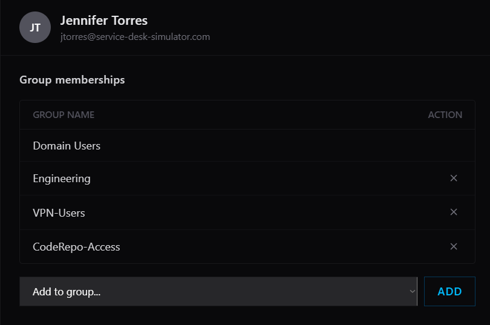 
  <em>Figure 3. Group Access.</em>

* After creating her profile, I confirmed with both her and her manager, Tom Wilson, to make sure everything was set up correctly. I even went a step further and helped her reset her password so she was able to log into her account for the first time.

  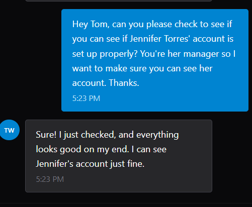 
  <em>Figure 4. Manager Confirmation.</em>

  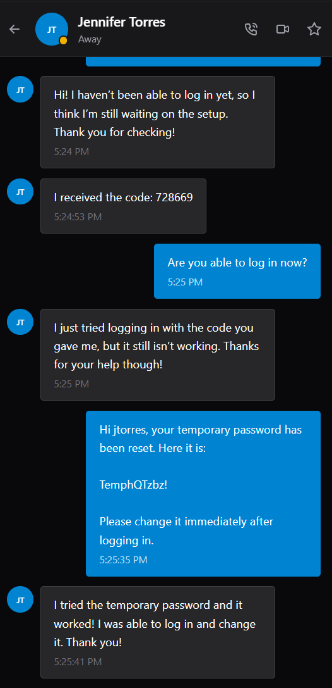 
  <em>Figure 5. User Confirmation.</em>

4. Lessons Learned

* Creating user accounts for new hires are time sensitive so we need to make sure the ticket is resolved on time.
* We will be informed or we will need to ask which groups they need to be a part of so we can properly assign their groups.
* We need to follow the company guidelines for naming conventions so it all stays the same.
* We need to create the user profile first before adding them to more groups.

5. Technologies Used

* Active Directory (Simulated)

## Scenario 3: My password is not working and I cannot log in to my computer

1. Scenario Overview

  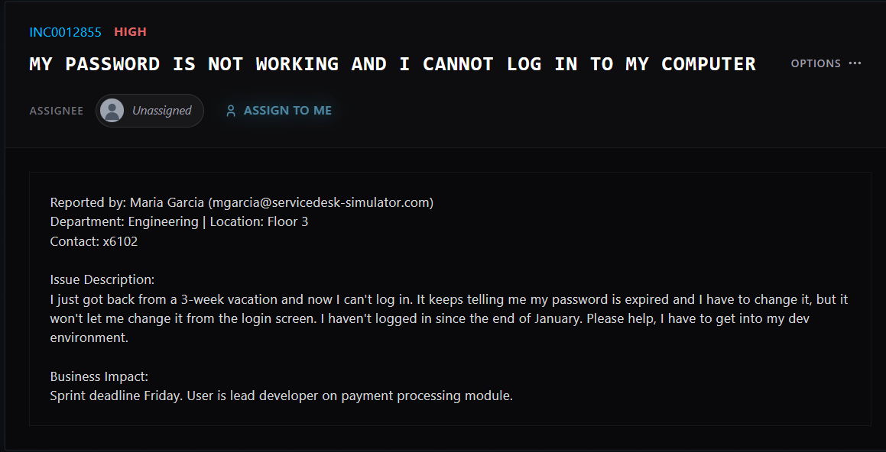 
  <em>Figure 1. Initial ticket.</em>

2. Initial Assessment

* Maria Garcia returned from a 3 week vacation and her password expired. She is the lead developer on the payment processing module and this issue is time sensitive. It sounds like I need to reset her password and give her a temporary password so she can log in and change it.

3. Investigation/Resolution

* The first step is to go to Active Directory and search up the user "Maria Garcia".

  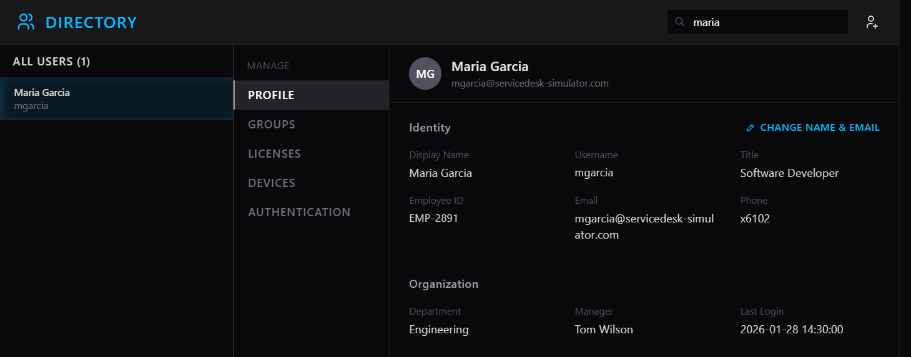 
  <em>Figure 2. Active Directory Search.</em>

* I then go to the "Authentication" tab and verify the identity of the user by asking for the verification code.

  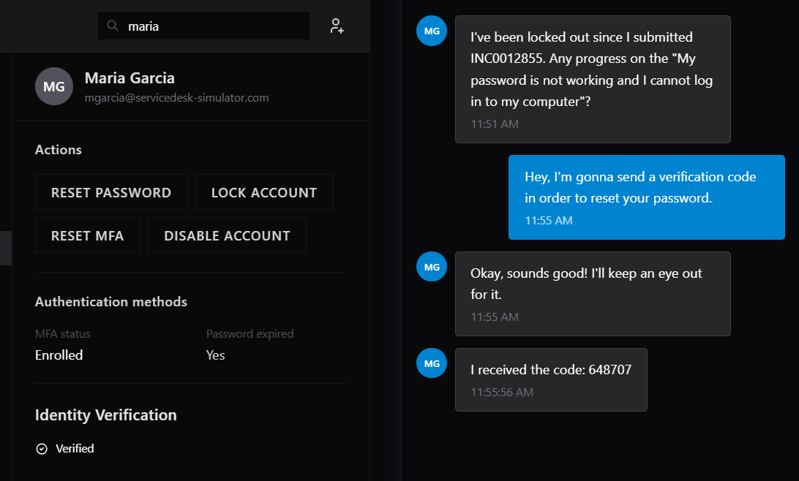 
  <em>Figure 3. Identity Verification.</em>

* Once the identity was confirmed, I was able to reset the password and send the temporary password to the correct user.

* The user was able to confirm that the temporary password worked and the user changed it after logging in.

  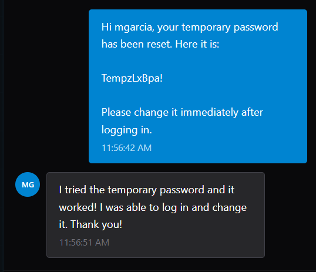 
  <em>Figure 4. User Confirmation.</em>

4. Lessons Learned

* Temporary passwords should only be communicated through secure channels.
* Temporary passwords must be changed immediately after logging in.

5. Technologies Used

* Active Directory (Simulated)

## Scenario 4: None of the printers in the office are working

1. Scenario Overview

  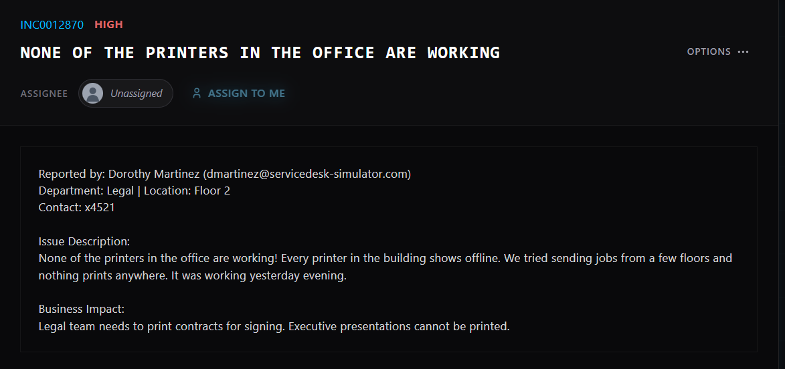 
  <em>Figure 1. Initial ticket.</em>

2. Initial Assessment

* Every printer in the office is showing offline and several business events are being held back as a result. Most likely need to see the printer server to see if something is wrong with it. If I am unable to fix it, it will need to be escalated.

3. Investigation/Resolution

* I first went to the server room and looked at the status of all of the servers.

  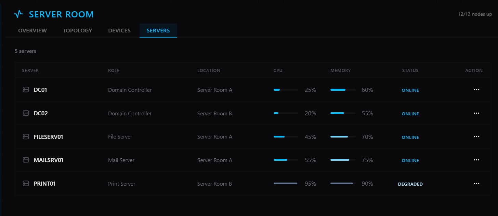 
  <em>Figure 2. Server Health.</em>

* I noticed that the printer server was overloaded and so I decided to reboot the server.

   
  <em>Figure 3. Server Reboot.</em>

* After rebooting the server, the CPU and memory usage decreased substantially.

  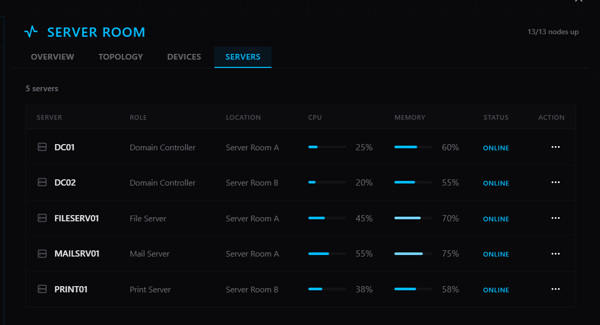 
  <em>Figure 4. Server Check.</em>

* I messaged the user on the teams chat in order to confirm that the printers were back online.

  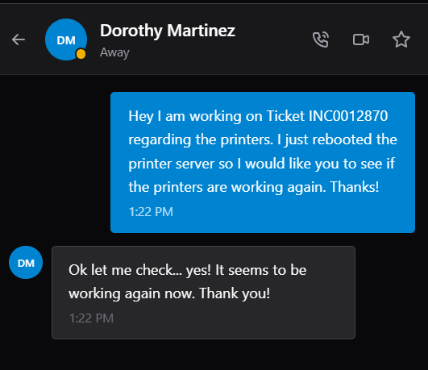 
  <em>Figure 5. User Confirmation.</em>

4. Lessons Learned

* Printer servers are single points of failures so if the server fails, all the printers cease to work.
* After a server reboot, users may need to clear previous jobs that were "stuck" in the queue.

5. Technologies Used

* Windows Server (Simulated)
* Print Server Administration (Simulated)

## Scenario 5: Internet completely down - cannot access anything

1. Scenario Overview

  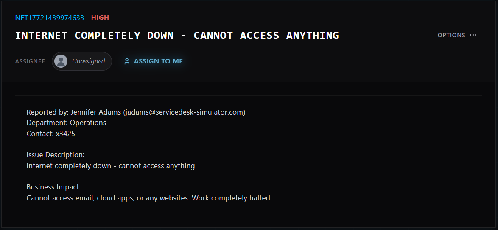 
  <em>Figure 1. Initial ticket.</em>

2. Initial Assessment

* Jennifer Adams submitted a ticket and stated that the Internet was completely down and she couldn't access anything. This ticket is considered a high priority cause her work has completely halted. My first thought is to check the Internet servers to see the health of it and check to see if it's overloaded or if it has completely shut down.

3. Investigation/Resolution

* I first contacted Jennifer to see if the Wi-Fi was the problem and she told me that she was connected to the Ethernet via a physical cable.

  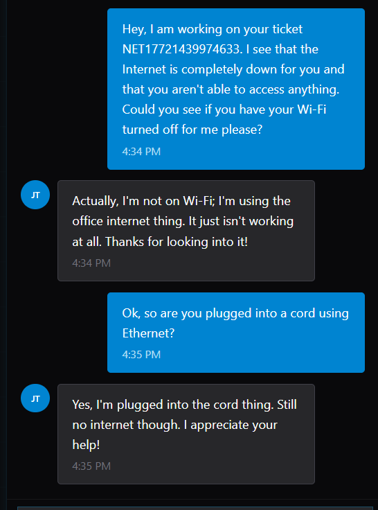 
  <em>Figure 2. User Inquiry.</em>

* I then went to the "Server Room" to check the health of all of the devices

  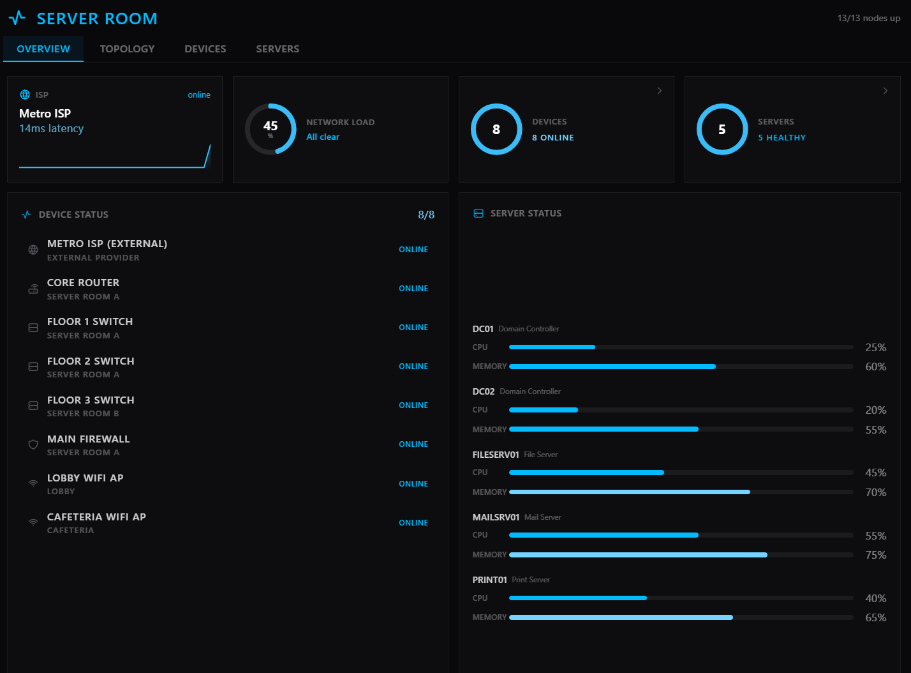 
  <em>Figure 2. Server Health.</em>

* All of the devices were up and running and I saw no issues of overloaded servers. I saw that the core router's uptime was 45 days so I decided to reboot the system to see if that solved the issue.

   
  <em>Figure 3. Server Reboot.</em>

* The user texted me on the teams chat that her connection came back but now some members of her team were dealing with the same issue. So I asked which floors they worked on as there are 3 floor switches for each team. She was unable to confirm which floors they worked on so I decided it was best to reset all 3 switches as two of them had uptimes of 30 days and one had an uptime of 15 days.

  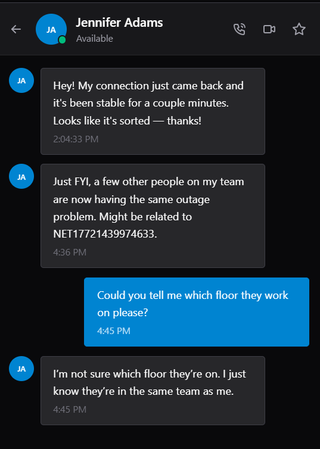 
  <em>Figure 4. User Confirmation.</em>

* I asked the user again if they solved the issue and she was able to tell me that she was still having issues so I decided to check the status of the external ISP as that could've been the issue.

  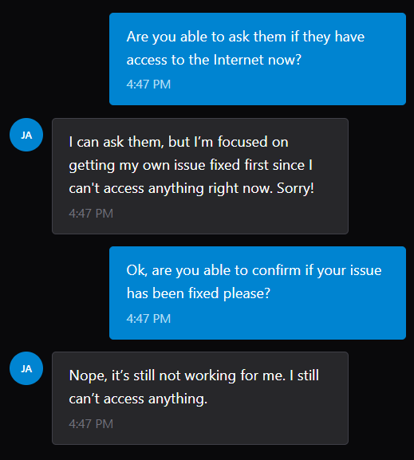 
  <em>Figure 5. Issue Fail.</em>

   
  <em>Figure 6. ISP Check.</em>

* I then asked the user to disconnect the Ethernet cable for a few seconds and then reconnect it to see if that fixed the issue and that did not work either.

  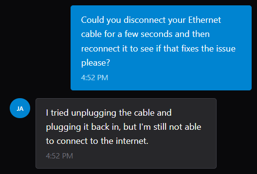 
  <em>Figure 7. Ethernet Disconnect.</em>

* After checking the status of the ISP status a few more times, the status of the ISP had degraded so I decided to contact the ISP and inform them of the problem.

   
  <em>Figure 6. ISP Degradation.</em>

* After hearing back from the ISP, I informed the entire company about the issue and when it would be fixed.

* 

4. Lessons Learned

* 

5. Technologies Used

*

## Scenario 6: 
