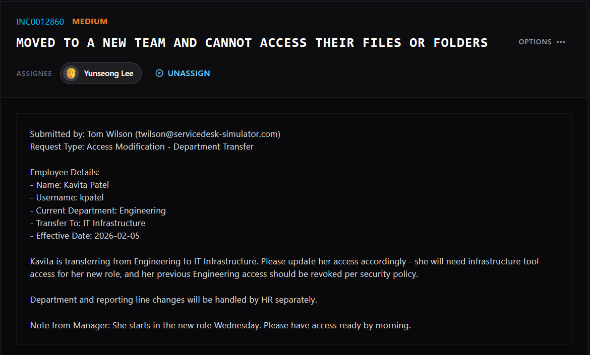

# ServiceDesk-Simulator
I am utilizing ServiceDesk-Simulator in order to gain real world experience in solving tickets for end users.

## Scenario 1: Cannot access email on mobile device

1. Scenario Overview

   
  <em>Figure 1. Initial service desk ticket.</em>

2. Initial Assessment
* The first step that I took check the Active Directory and search up Kavtia Patel.
* 

   
  <em>Figure 2. Active Directory Search.</em>

* Once I clicked on her name, I went to the "Groups" tab and found that she was under "Engineering"
