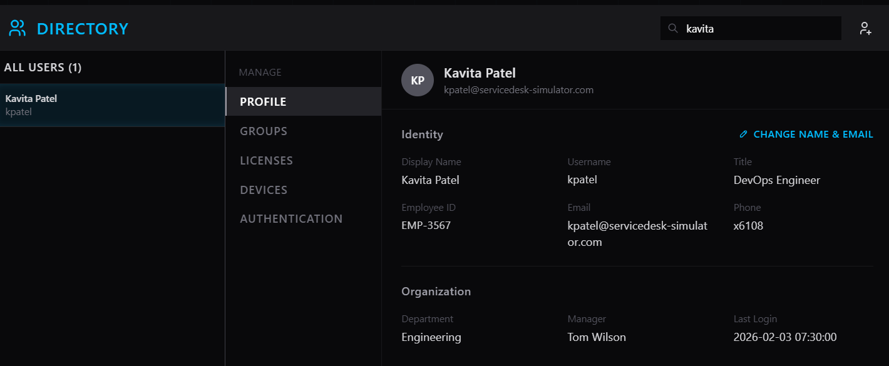
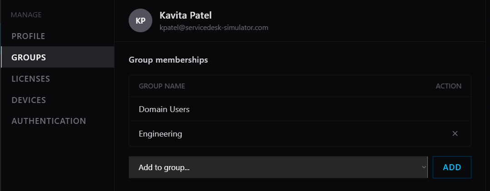
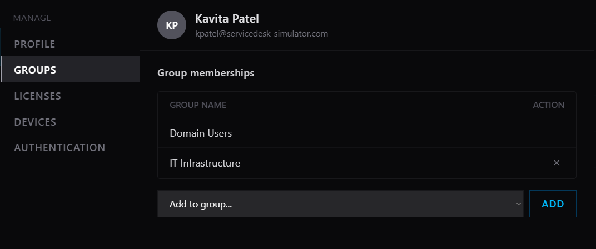
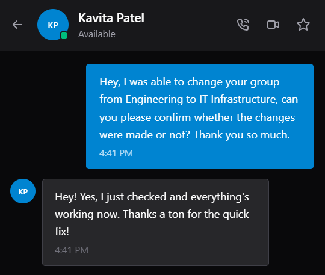
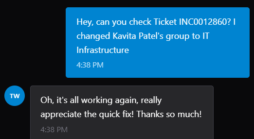

# ServiceDesk-Simulator
I am utilizing ServiceDesk-Simulator in order to gain real world experience in solving tickets for end users.

## Scenario 1: Moved to a new team and cannot access their files or folders

1. Scenario Overview

   
  <em>Figure 1. Initial ticket.</em>

2. Initial Assessment

* Kavita Patel's manager submitted a ticket as she was transferring departments and needed access to a new set of tools specific to that department. The manager also requested that she be removed from the old group as well. Transferring groups can be done in Active Directory.

3. Investigation/Resolution

* The first step that I took check the Active Directory and search up Kavtia Patel.

   
  <em>Figure 2. Active Directory Search.</em>

* Once I clicked on her name, I went to the "Groups" tab and found that she was under "Engineering".

   
  <em>Figure 3. Engineering Group.</em>

* I then removed her from the "Engineering" group to the "IT Infrastructure" group.

   
  <em>Figure 4. IT Infrastructure Group.</em>

* Lastly, I messaged her manager Tom Wilson, who submitted the ticket to confirm whether or not the changes were submitted correctly.

   
  <em>Figure 5. User Confirmation.</em>

   
  <em>Figure 6. Manager Confirmation.</em>

4. Lessons Learned

* Department transfers require removing old groups and adding new ones
* Not removing access to old group memberships provides a security risk as they have accesss that is no longer necessary
* Always need to verify if the transfer request comes from an authorized user
* Make sure to document every change like who requested it and when

5. Technologies Used

* Active Directory

## Scenario 2: New employee starting Monday - needs account setup

1. Scenario Overview

   
  <em>Figure 1. Initial ticket.</em>

2. Initial Assessment

* Robert Torres submitted a ticket for a new hire with the name of Jennifer Torres. He provided all of the employee's relevant details and outlined which sepcific groups that she needs to be included in to gain specific access.

3. Investigation/Resolution

* The first step that I took was to go to Active Directory to create a profile for Jennifer.

   
  <em>Figure 2. Active Directory Search.</em>

* 
4. Lessons Learned
